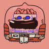

# Team

<figure><figcaption>
 <a href="https://wattsy.art">Wattsy</a>
</figcaption></figure>

Wattsy is the lead developer and co-founder of [Kohi Art Community](https://kohi.art), an Ethereum-based generative art platform with a goal to become an autonomous hyperstructure for L1-based native artworks.&#x20;

He has funded, produced, and co-developed a commercial game release with a custom game engine. His other work includes on-chain art and token rendering for popular NFT projects [CrypToadz](https://cryptoadz.io) and [CryptoDickbutts](https://cryptodickbutts.com).

_More to come..._

